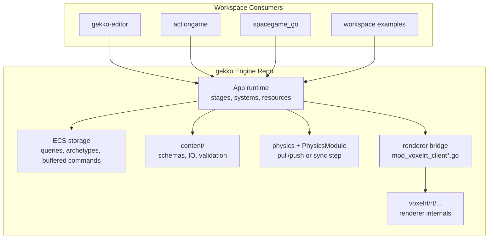

# Architecture — Gekko Engine

## System Overview

`gekko` is the engine module in the broader `gekko3d` workspace. It provides the shared runtime loop, ECS storage and queries, buffered mutation model, authored-content loading/spawn paths, physics integration, and the bridge to the `voxelrt` renderer. Consumer modules import this package and rely on its runtime and content contracts, so changes in the engine often have downstream effects outside this repo.

## Architecture Diagram

## Core Components

### App Runtime

- **Purpose:** Owns stages, systems, resources, app state transitions, and the main run loop
- **Technology:** Go root package
- **Source:** `app.go`, `app_builder.go`, `schedule.go`
- **Key Behaviors:** stage execution, reflective dependency resolution, command flush timing

### ECS And Commands

- **Purpose:** Store entities/components and buffer structural mutations
- **Technology:** Root package plus `ecs/`
- **Source:** `ecs.go`, `ecs_query.go`, `commands.go`, `ecs/`
- **Key Behaviors:** archetype queries, buffered add/remove flows, entity grouping

### Authored Content Layer

- **Purpose:** Define and validate runtime-authored asset, level, terrain, and world formats
- **Technology:** JSON-backed Go structs and loaders
- **Source:** `content/`, `asset_content_spawn.go`, `level_content_spawn.go`, `runtime_content_loader.go`
- **Key Behaviors:** schema normalization, IO, eager level spawn, streamed world preparation

### Physics Integration

- **Purpose:** Connect ECS state to simulation state
- **Technology:** Root package plus `physics/`
- **Source:** `mod_physics_module.go`, `mod_physics_loop.go`, `physics/`
- **Key Behaviors:** async pull/push model, synchronous fixed-step path, collision and rigid-body bridging

### Renderer Bridge

- **Purpose:** Translate ECS-facing engine state into renderer objects and passes
- **Technology:** Root package bridge over `voxelrt/rt/...`
- **Source:** `mod_voxelrt_client.go`, `mod_voxelrt_client_systems.go`, `mod_voxelrt_client_materials.go`, `mod_voxelrt_client_skybox.go`
- **Key Behaviors:** scene extraction, runtime asset upload, debug overlays, particle and water integration

## Data Flow — Primary Runtime Path

1. `NewApp()` constructs an `App` with ECS storage, stage maps, and module list.
2. `app.build()` installs stages and lets each module register resources and systems.
3. The runtime executes systems stage by stage.
4. Systems receive `*Commands` and registered resource pointers via reflective lookup.
5. Structural ECS mutations buffer through `Commands` and become visible after the stage flush.
6. Physics and renderer bridges synchronize engine state into their own runtime layers.
7. Consumer apps or tools observe the resulting world state, render output, or authored content behavior.

## Security Model

- **Authentication:** none in this repo; this is an engine/library module
- **Authorization:** none in this repo
- **Secrets:** none found in repo-local configuration
- **Network:** desktop/local execution model; no deployment topology was found in this repo

## Scalability & Resilience

- Buffered ECS mutation keeps structural changes deterministic across a stage.
- Modules isolate resource ownership and stage placement.
- Physics supports async and synchronous execution models.
- Rendering is split between ECS-facing bridge code and lower-level renderer internals for narrower verification.

## Key Design References

| Reference | Summary |
|---|---|
| `docs/engine/runtime.md` | Runtime loop, stages, buffering, dependency resolution |
| `docs/engine/modules.md` | Module ownership map |
| `docs/engine/physics.md` | Physics integration model |
| `docs/renderer/overview.md` | Renderer architecture entry point |
| `docs/workflows/agent-task-loop.md` | Agent task classification and verification flow |

