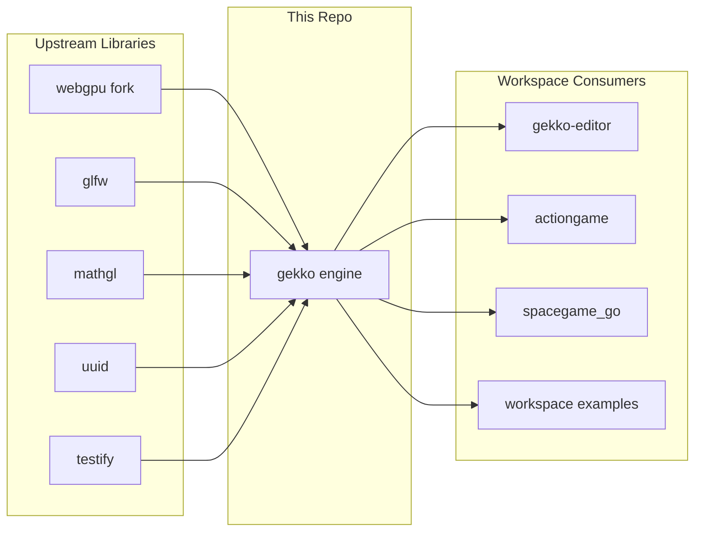

# Dependencies — Gekko Engine

## Dependency Map

## Upstream Dependencies (We Consume)

| Service / System | Type | Protocol | Purpose | Owner | Failure Impact |
|---|---|---|---|---|---|
| `github.com/ddevidchenko/webgpu` (replace for `github.com/cogentcore/webgpu`) | External library | Go module | WebGPU bindings used by renderer/runtime | [NEEDS VERIFICATION] | Renderer build/runtime paths fail |
| `github.com/go-gl/glfw/v3.3/glfw` | External library | Go module | Desktop window/input integration | [NEEDS VERIFICATION] | Windowed apps and renderer input paths fail |
| `github.com/go-gl/mathgl` | External library | Go module | Math vectors, matrices, quaternions | [NEEDS VERIFICATION] | Core runtime, renderer, and physics code fail to compile |
| `github.com/google/uuid` | External library | Go module | Stable identifiers in content/runtime helpers | [NEEDS VERIFICATION] | UUID-based flows fail to compile |
| `golang.org/x/image` | External library | Go module | Image helpers for runtime assets | [NEEDS VERIFICATION] | Asset/image-related code fails to compile |

## Downstream Dependencies (Consume Us)

| Service / System | Type | Protocol | What They Consume | Owner |
|---|---|---|---|---|
| `gekko-editor` | Internal workspace module | Go module import | Engine runtime, content formats, renderer bridge assumptions | [NEEDS VERIFICATION] |
| `actiongame` | Internal workspace module | Go module import | Shared runtime/gameplay modules | [NEEDS VERIFICATION] |
| `spacegame_go` | Internal workspace module | Go module import | Shared engine runtime and large-world integration points | [NEEDS VERIFICATION] |
| Workspace examples | Internal workspace modules | Go module import | Focused engine/renderer samples | [NEEDS VERIFICATION] |

## Infrastructure Dependencies

| Resource | Type | Details | Provisioned By |
|---|---|---|---|
| Desktop graphics session | Local runtime dependency | Needed for `go run` of GLFW/WebGPU apps | Developer machine |
| Temporary Go cache | Local build dependency | Use `/tmp/gekko3d-gocache` in this environment | Developer machine |

## Critical Libraries

| Library | Version | Purpose | Notes |
|---|---|---|---|
| `github.com/cogentcore/webgpu` via replace | `v0.0.0-20260417122705-45846438a839` | GPU abstraction for renderer paths | Replaced with a custom fork in `go.mod` |
| `github.com/go-gl/glfw/v3.3/glfw` | `v0.0.0-20250301202403-da16c1255728` | Windowing and input | Desktop runtime dependency |
| `github.com/go-gl/mathgl` | `v1.2.0` | Math primitives | Used across runtime, renderer, and physics |
| `github.com/stretchr/testify` | `v1.10.0` | Test assertions | Used in repo tests |

## Shared / Internal Libraries

| Library | Version | Purpose | Repo |
|---|---|---|---|
| `voxelrt/rt/...` | In-tree | Renderer internals consumed by bridge code | This repo |
| `content/...` | In-tree | Authored asset and level formats | This repo |
| `physics/...` | In-tree | Simulation types and helpers | This repo |

## API Contracts

| API | Spec Location | Version | Breaking Change Policy |
|---|---|---|---|
| Go engine package surface | Source files plus `docs/engine/*.md` | No explicit semver policy documented in repo | Treat shared engine exports as consumer-facing and high-scrutiny |
| Authored asset schema (`.gkasset`) | `docs/content/game-assets.md`, `content/` | Schema-versioned in code | Preserve backward compatibility unless intentionally migrating |
| Authored level/world formats (`.gklevel`, terrain/imported world data) | `docs/content/levels.md`, `docs/content/streaming-and-worlds.md` | Schema/version rules in code and docs | Verify editor and runtime boundaries when changed |

## Environment Configuration

| Config Key | Description | Where Managed | Differs Per Env? |
|---|---|---|---|
| `GOCACHE` | Recommended local cache override for reliable `go test` in this environment | Shell env at command runtime | Yes |
| `cwd` | Run app/test commands from the owning module directory | Developer workflow | Yes |

